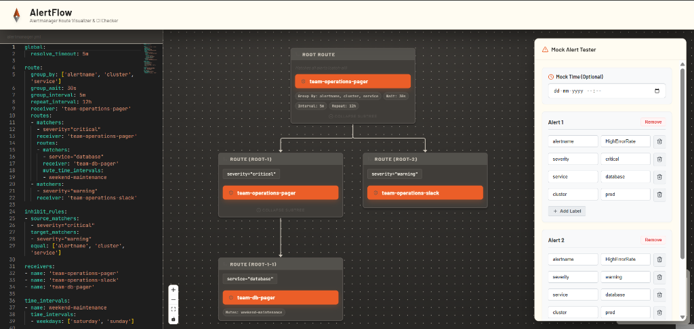

#  AlertFlow

**A visual simulator and CI/CD testing engine for Prometheus Alertmanager configurations.**



## The Problem
Configuring Prometheus Alertmanager is notoriously difficult. With complex routing trees, nested matchers, `continue` directives, time-based mutes, and inhibition rules, it is almost impossible to know exactly where an alert will go until it fires in production at 3 AM. 

Existing tools either just check your YAML syntax or provide outdated UIs that ignore crucial routing logic (like Inhibition).

## The Solution
**AlertFlow** bridges the gap between Development and Operations:
1. **Interactive UI**: A gorgeous, glassmorphism-styled React application that parses your `alertmanager.yml` and draws a massive interactive routing tree. 
2. **Simulation Engine**: Under the hood, AlertFlow imports the official Alertmanager Go packages. When you dispatch a mock alert in the UI, AlertFlow simulates exactly how the real Alertmanager would route it, fully respecting `inhibit_rules` and `mute_time_intervals`.
3. **CI/CD Regression Testing**: AlertFlow isn't just a UI toy. It ships with a CLI tool designed to run in GitHub Actions to ensure pull requests don't silently break your routing behavior.

---

## ⚡ Quickstart

AlertFlow is distributed via Docker with heavily optimized, multi-stage builds. You don't need Go or Node.js installed to run it.

```bash
# Clone the repository
git clone https://github.com/username/alertflow.git
cd alertflow

# Boot the frontend and backend instantly in the background
docker-compose up -d --build
```
> Open your browser to **[http://localhost:5173](http://localhost:5173)**. A complex demo configuration will be pre-loaded so you can see it in action immediately!

---

## 🛠 Features

### 1. Multi-Alert Simulation & Inhibition
Alertmanager allows high-priority alerts to suppress low-priority alerts via `inhibit_rules`. AlertFlow is one of the only visualizers that can process arrays of multiple alerts simultaneously, highlighting inhibited alerts in **RED** on the routing tree.

### 2. Time-Travel Mute Testing
Using the Datetime picker in the Mock Alert Tester, you can simulate alerts firing during specific hours. AlertFlow will evaluate your `mute_time_intervals` and `active_time_intervals`, highlighting muted routes in **ORANGE**.

### 3. CI/CD Pipeline Integration (The CLI)
You can run AlertFlow in your terminal or GitHub Actions pipeline to catch regressions *before* they merge.

**Validate Syntax:**
```bash
alertflow check alertmanager.yml
```

**Prevent Regressions:**
Test a new config against an old config using a suite of JSON mock alerts. If the routing behavior changes (e.g. an alert that used to page the DBA team now drops into the void), the CI build will fail!
```bash
alertflow diff old.yml new.yml --alerts sample-alerts.json
```

---

## Architecture
- **Backend**: Go (using `github.com/prometheus/alertmanager/config` and `dispatch`)
- **Frontend**: React + Vite (using `reactflow` for rendering)
- **Deployment**: Docker Compose (Multi-stage Alpine/Nginx images)
